# test-process-part
### 🛠️ 协作工具与技术栈 (Tools & Tech Stack)

| 类别 | 工具徽章 (点击跳转官网) |
| :--- | :--- |
| **沟通协作** |  |
| **任务管理** |  |
| **版本控制** |  |
| **核心框架** |   |
| **设计与建模** |   |
| **敏捷开发** |  |

---

### 🌐 快速导航图标库

如果你想要截图下方那种“一排纯图标”的简约感，并且要求**每个图标都能独立跳转**，请使用以下代码（我将它们拆分开了，因为单一的 `skillicons` 图片无法实现局部点击）：

---

### I. 小组使用的工具与具体合作方式

#### 📅 会议 
* **形式**：线下利用课后时间面对面讨论。
* **记录**：所有会议纪要均同步至 Notion 任务看板。

#### 🌿 版本控制 
* 所有代码提交和版本发布的**唯一平台**。
* 遵循 Git Flow 工作流，确保主分支稳定性。

* 

  
  
  

  
  
  
  
  
  
  

### 🎮 Game Entities Exhibition

#### 1. Character
<table width="100%">
<thead>
<tr><th width="15%">Name</th><th width="20%">State / Form</th><th width="25%">Image</th><th width="40%">Description</th></tr>
</thead>
<tbody>
<tr><td rowspan="4" align="center"></td><td align="center">Idle Animation</td><td align="center"></td><td align="center">The player yawns if idle for 2 seconds.</td></tr>
<tr><td align="center">Dynamic Trail Effect</td><td align="center"></td><td align="center">Trailing effects are generated while the player is moving.</td></tr>
<tr><td align="center">Jump & Landing VFX</td><td align="center"></td><td align="center">Visual feedback and particle effects triggered during jumping and landing.</td></tr>
<tr><td align="center">Death Animation</td><td align="center"></td><td align="center">Feedback animation triggered when colliding with obstacles or hostile targets.</td></tr>
<tr><td rowspan="2" align="center"></td><td align="center">Invisible when Idle</td><td align="center"></td><td align="center">The phantom remains invisible when no playback is occurring.</td></tr>
<tr><td align="center">Visible during Playback</td><td align="center">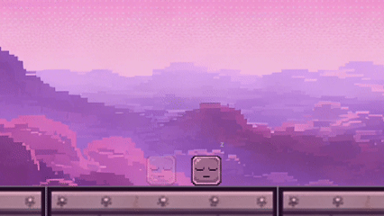</td><td align="center">The phantom becomes visible and gains collision volume during playback.</td></tr>
<tr><td rowspan="2" align="center"></td><td align="center">Default Animation</td><td align="center"></td><td align="center">Idle state when not in interaction.</td></tr>
<tr><td align="center">Dialogue Trigger</td><td align="center"></td><td align="center">The NPC displays a cute expression during interaction.</td></tr>
<tr><td rowspan="2" align="center"></td><td align="center">Stomp Kill</td><td align="center"></td><td align="center">Patrol units; can only be defeated by stomping from above. Stomping allows the player to jump higher.</td></tr>
<tr><td align="center">Killed by Enemy</td><td align="center">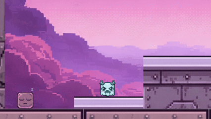</td><td align="center">The player is defeated when colliding with an enemy from the side.</td></tr>
</tbody>
</table>

#### 2. Interactables
<table width="100%">
<thead>
<tr><th width="15%">Name</th><th width="20%">State / Form</th><th width="25%">Image</th><th width="40%">Description</th></tr>
</thead>
<tbody>
<tr><td rowspan="2" align="center"></td><td align="center">Legacy Activation</td><td align="center"></td><td align="center">Opened by standing on two buttons simultaneously in older versions.</td></tr>
<tr><td align="center">Current Activation</td><td align="center"></td><td align="center">Activated by stepping on a button to release electrical current.</td></tr>
<tr><td rowspan="2" align="center"></td><td align="center">Basic Form</td><td align="center"></td><td align="center">Standard metal spikes; a permanent hazard.</td></tr>
<tr><td align="center">Colored Form</td><td align="center"></td><td align="center">Colored spikes controlled by buttons; colors correspond to logic switches.</td></tr>
<tr><td rowspan="2" align="center"></td><td align="center">Inactive</td><td align="center"></td><td align="center">Waypoints in the scene waiting to be activated.</td></tr>
<tr><td align="center">Auto-activation</td><td align="center"></td><td align="center">Automatically activates when the player is nearby; the player respawns here after death.</td></tr>
<tr><td rowspan="2" align="center"></td><td align="center">Proximity Prompt</td><td align="center">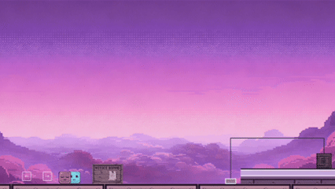</td><td align="center">Press the 'E' key to interact when close to the sign.</td></tr>
<tr><td align="center">Detailed Reading</td><td align="center">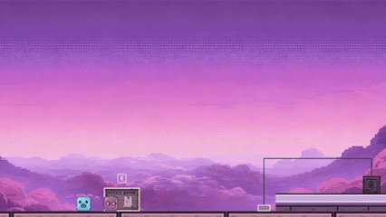</td><td align="center">Interact to read the detailed content provided on the board.</td></tr>
<tr><td rowspan="2" align="center"></td><td align="center">Inactive</td><td align="center"></td><td align="center">Initial silent state; teleportation is unavailable.</td></tr>
<tr><td align="center">Active</td><td align="center"></td><td align="center">A number appears on the gate when active; players press the key to teleport.</td></tr>
<tr><td align="center"></td><td align="center">Physical Collision</td><td align="center">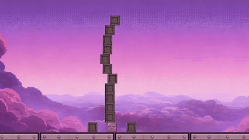</td><td align="center">Features real collision volume and is pushable, following realistic physics.</td></tr>
</tbody>
</table>

#### 3. Prompts
<table width="100%">
<thead>
<tr><th width="15%">Name</th><th width="20%">State / Form</th><th width="25%">Image</th><th width="40%">Description</th></tr>
</thead>
<tbody>
<tr><td rowspan="2" align="center"></td><td align="center">Dynamic Fade</td><td align="center"></td><td align="center">Hidden UI that surfaces only when the player approaches specific interactive objects.</td></tr>
<tr><td align="center">Unit Key Tips</td><td align="center">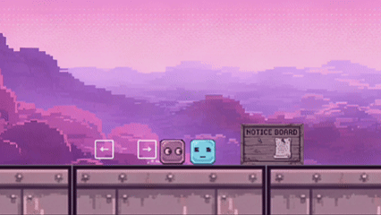</td><td align="center">Contextual key prompts for NPCs, Teleport Points, or Signboards.</td></tr>
<tr><td align="center"></td><td align="center">Proximity Trigger</td><td align="center">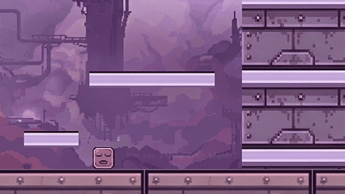</td><td align="center">Text notifications triggered when the player approaches.</td></tr>
</tbody>
</table>

#### 4. Systems
<table width="100%">
<thead>
<tr><th width="15%">Name</th><th width="20%">State / Form</th><th width="25%">Image</th><th width="40%">Description</th></tr>
</thead>
<tbody>
<tr><td rowspan="2" align="center"></td><td align="center">Electrical Activation</td><td align="center"></td><td align="center">Player/Phantom steps on the button to release current and activate the final gate.</td></tr>
<tr><td align="center">Current Fade / Gate Close</td><td align="center">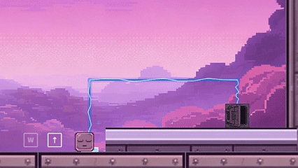</td><td align="center">When the button is released, the current fades and the gate eventually closes.</td></tr>
<tr>
    <td rowspan="2" align="center"></td>
    <td align="center">Button-Controlled Spikes</td>
    <td align="center">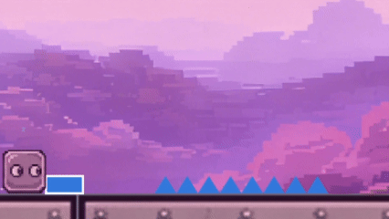</td>
    <td align="center">Press the button to toggle spike visibility; the player dies upon contact when spikes are visible.</td>
</tr>
<tr height="0" style="line-height:0;">
    <td colspan="3" style="padding:0; margin:0; font-size:0;">&nbsp;</td>
</tr>
<tr><td align="center"></td><td align="center">Button-Controlled Platform</td><td align="center"></td><td align="center">Press the button to toggle platform visibility; the platform gains collision when visible.</td></tr>
</tbody>
</table>

#### 5. Terrain
<table width="100%">
<thead>
<tr><th width="15%">Name</th><th width="20%">State / Form</th><th width="25%">Image</th><th width="40%">Description</th></tr>
</thead>
<tbody>
<tr><td align="center"></td><td align="center">Platform Form</td><td align="center">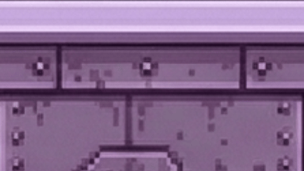</td><td align="center">Visual representation of the floating platforms.</td></tr>
<tr><td align="center"></td><td align="center">Ground Form</td><td align="center">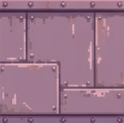</td><td align="center">Visual representation of the standard walking ground.</td></tr>
<tr><td align="center"></td><td align="center">Wall Form</td><td align="center">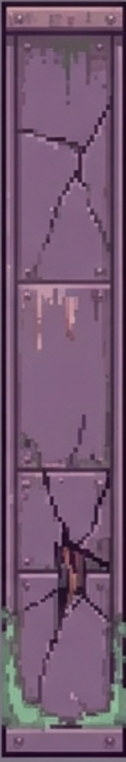</td><td align="center">Visual representation of the terrain boundaries and walls.</td></tr>
</tbody>
</table>

### 🎮 Recording System Exhibition

<table>
<tbody>
<tr>
<td align="center" style="padding: 20px;">
  
  

• <b>Phase Description:</b> The player observes the level terrain and mechanism distribution. The system is on standby, ready to record position and interaction logic. 
• <b>Timeline Behavior:</b> No timeline is active; the player can move freely. 
• <b>Control Guide:</b> Press <b>C</b> to begin recording.

</td>
</tr>

<tr>
<td align="center" style="padding: 20px;">
  
  

• <b>Phase Description:</b> All player operations are being recorded. The system captures the motion path and interaction in real-time. 
• <b>Timeline Behavior:</b> The operation timeline displays corresponding input records. 
• <b>Control Guide:</b> Press <b>C</b> to end recording early.

</td>
</tr>

<tr>
<td align="center" style="padding: 20px;">
  
  

• <b>Phase Description:</b> Recording finished. The phantom appears in a transparent state, ready for playback at any moment. 
• <b>Timeline Behavior:</b> The recorded trajectory remains on the timeline. 
• <b>Control Guide:</b> Hold <b>R</b> to start the action playback.

</td>
</tr>

<tr>
<td align="center" style="padding: 20px;">
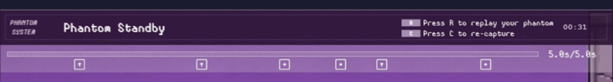  
  

• <b>Phase Description:</b> The phantom repeats all actions recorded, assisting the player in solving level puzzles. 
• <b>Timeline Behavior:</b> The timeline turns blue and displays real-time playback progress. 
• <b>Control Guide:</b> Press <b>R</b> to end playback early.

</td>
</tr>

<tr>
<td align="center" style="padding: 20px;">
  
  

• <b>Phase Description:</b> Playback ends. The phantom returns to a transparent state, staying at the finish point or awaiting instructions. 
• <b>Timeline Behavior:</b> The timeline retains the full record of the last operation. 
• <b>Control Guide:</b> Hold <b>R</b> to replay, or press <b>C</b> to start a new recording (overwriting the current one).

</td>
</tr>
</tbody>
</table>

