# test-process-part
### 🛠️ 协作工具与技术栈 (Tools & Tech Stack)

| 类别 | 工具徽章 (点击跳转官网) |
| :--- | :--- |
| **沟通协作** |  |
| **任务管理** |  |
| **版本控制** |  |
| **核心框架** |   |
| **设计与建模** |   |
| **敏捷开发** |  |

---

### 🌐 快速导航图标库

如果你想要截图下方那种“一排纯图标”的简约感，并且要求**每个图标都能独立跳转**，请使用以下代码（我将它们拆分开了，因为单一的 `skillicons` 图片无法实现局部点击）：

---

### I. 小组使用的工具与具体合作方式

#### 📅 会议 
* **形式**：线下利用课后时间面对面讨论。
* **记录**：所有会议纪要均同步至 Notion 任务看板。

#### 🌿 版本控制 
* 所有代码提交和版本发布的**唯一平台**。
* 遵循 Git Flow 工作流，确保主分支稳定性。

* 

  
  
  

  
  
  
  
  
  
  

### 🎮 Game Entities

<table>
<thead>
<tr><th align="center">Name</th><th align="center">State/Form</th><th align="center">Demo (Image)</th><th align="center">Description</th></tr>
</thead>
<tbody>
<tr><td rowspan="4" align="center"></td><td align="center">Idle Animation</td><td align="center">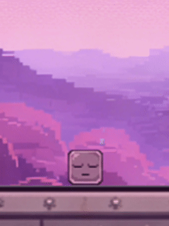</td><td align="center">A looping GIF of the player's breathing/idle state while stationary.</td></tr>
<tr><td align="center">Movement</td><td align="center">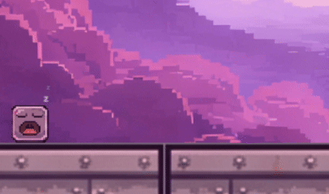</td><td align="center">Demonstrates the player's basic movement.</td></tr>
<tr><td align="center">Jump</td><td align="center">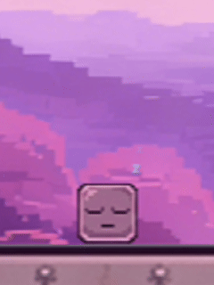</td><td align="center">Visual feedback and particle effects triggered during takeoff and landing.</td></tr>
<tr><td align="center">Death Animation</td><td align="center">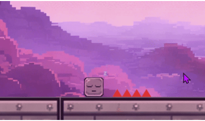</td><td align="center">Failure feedback animation when the character touches obstacles or hostile targets.</td></tr>
<tr><td rowspan="2" align="center"></td><td align="center">Base Animation</td><td align="center">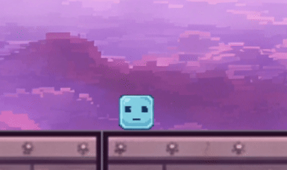</td><td align="center">Idle state when not interacting.</td></tr>
<tr><td align="center">Facial Expression Trigger</td><td align="center">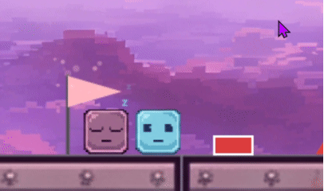</td><td align="center">Secondary form of the NPC during interaction.</td></tr>
<tr><td rowspan="2" align="center"></td><td align="center">Basic Form</td><td align="center">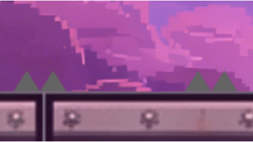</td><td align="center">Standard metal spikes, serving as permanent hazards.</td></tr>
<tr><td align="center">Colored Form</td><td align="center">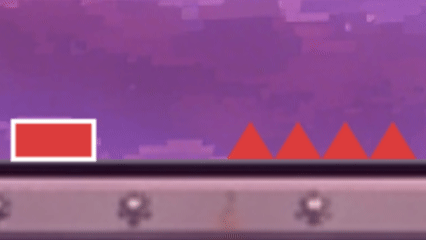</td><td align="center">Colored spikes controlled by buttons; colors correspond to logic switches.</td></tr>
<tr><td rowspan="2" align="center"></td><td align="center">Closed</td><td align="center">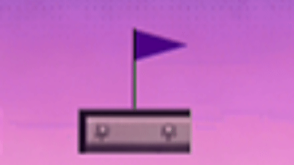</td><td align="center">Initial silent form, unable to perform spatial displacement.</td></tr>
<tr><td align="center">Opened</td><td align="center">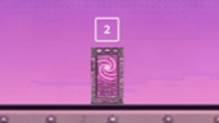</td><td align="center">Once activated, numbers appear; players press the corresponding key to teleport.</td></tr>
<tr><td rowspan="2" align="center"></td><td align="center">Inactive</td><td align="center">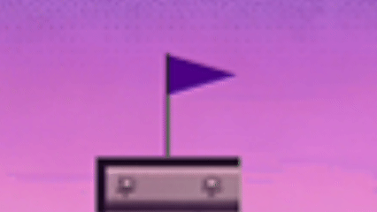</td><td align="center">A waypoint in the scene waiting to be activated.</td></tr>
<tr><td align="center">Auto-Activation</td><td align="center">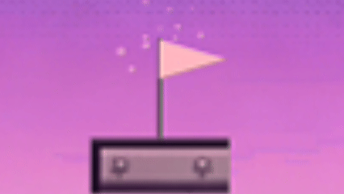</td><td align="center">Automatically activates when the player approaches.</td></tr>
<tr><td align="center"></td><td align="center">Transparent/Colored Plateform</td><td align="center">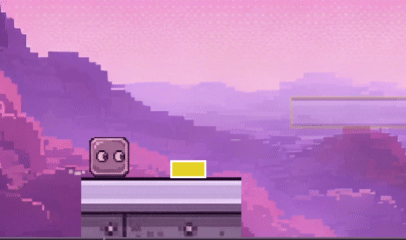</td><td align="center">Platform controlled by buttons; displays the button's color once activated.</td></tr>
<tr><td align="center"></td><td align="center">Electric Activation</td><td align="center">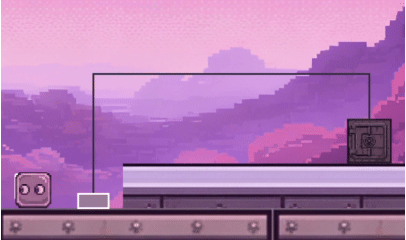</td><td align="center">Player/Ghost stands on the button to release current and open the final gate.</td></tr>
<tr><td align="center"></td><td align="center">Jump to Kill</td><td align="center">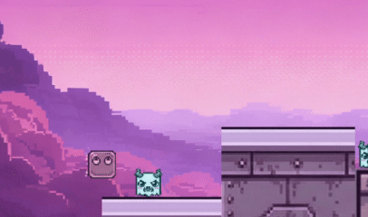</td><td align="center">Patrolling units that player/ghosts can only defeat by stomping from above.</td></tr>
</tbody>
</table>

### 🎮 Instruction System

<table>
<thead>
<tr><th align="center">Name</th><th align="center">State/Form</th><th align="center">Demo (Image)</th><th align="center">Description</th></tr>
</thead>
<tbody>
<tr><td align="center"></td><td align="center">Dynamic Display</td><td align="center">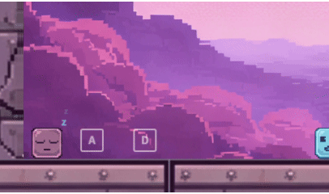</td><td align="center">Hidden UI that only appears when the player approaches specific interactive objects.</td></tr>
</tbody>
</table>

### 🎮 Recording System

<table>
<tbody>
<tr>
<td align="center">
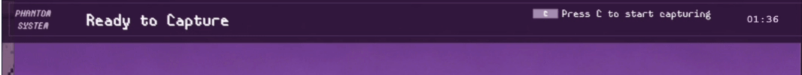 
 
<b>Explanation:</b> Initial planning phase. The player observes the level terrain and mechanism distribution while the system is on standby to record movement and interaction logic.
</td>
</tr>
<tr>
<td align="center">
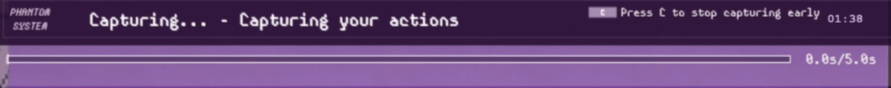 
 
<b>Explanation:</b> Action execution phase. The system captures and stores the player's path, jump height, and exact button timestamps in real-time with visual feedback.
</td>
</tr>
<tr>
<td align="center">
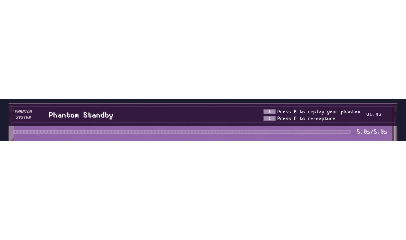 
 
<b>Explanation:</b> Spatiotemporal replay phase. Past ghosts automatically repeat recorded actions; the player must cooperate with the ghost (e.g., ghost holds a button while the player passes through the gate) to solve puzzles.
</td>
</tr>
</tbody>
</table>
